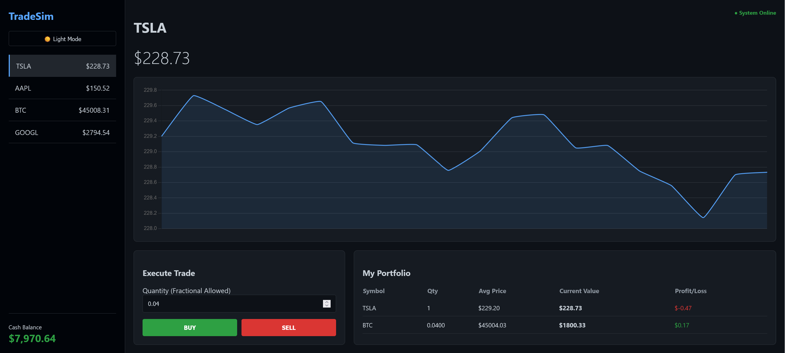
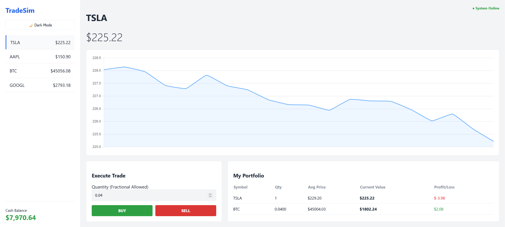

# TradeSim

TradeSim is a full-stack financial simulation platform designed to mimic a high-frequency trading environment. Unlike standard web applications that rely on HTTP polling, this project utilizes WebSockets (Socket.io) to establish a persistent, bi-directional connection between the client and server. This architecture enables millisecond-latency price updates and instant trade confirmations without requiring page refreshes.

The system is powered by a custom Node.js backend that acts as a central market maker, generating independent volatility and trend logic for multiple assets. On the frontend, the application supports fractional share trading via high-precision floating-point arithmetic and features a dynamic portfolio engine that recalculates the weighted average cost basis and Profit/Loss in real-time.

### Tech Stack
* **JavaScript (ES6+)** & **Node.js**
* **Express** & **Socket.io**
* **HTML5** & **CSS3 Variables**
* **Chart.js**